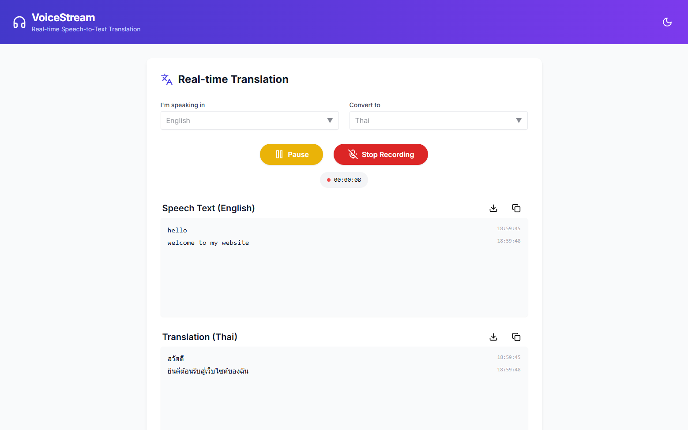
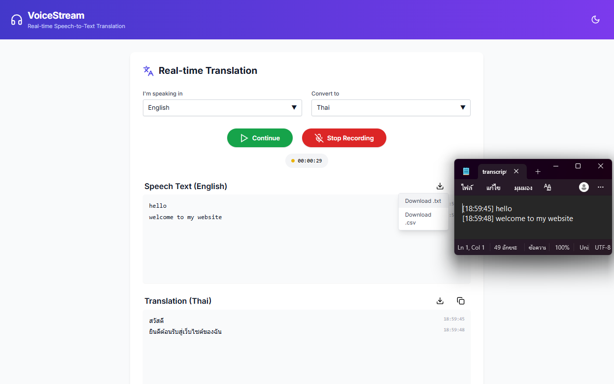

# **VoiceStream (Speech-to-Text Translator)** 🎤 

This project was initially generated from a StackBlitz requirement and later extended with additional features and improvements.

It provides _real-time speech-to-text_ and _automatic translation with timestamp logging, pause/resume functionality, and transcript export._

## ❤️ Live Demo

https://speech-to-text-zeta-inky.vercel.app

## 🔧 Note

Originally integrated with **Google Speech-to-Text and Translate APIs**, but later switched to **free alternatives**:

* Web Speech API (speech recognition)
* MyMemory API (translation)

to simplify deployment and remove dependency on paid services.

## 🛠️ Tech Stack
Frontend
* React (Vite)
* TypeScript
* Tailwind CSS
  
Backend
* Node.js
* REST API

APIs & Tools
* Web Speech API (Speech Recognition)
* Translation API

Deployment
* Frontend: Vercel
*Backend: Render

## 🚀 Installation

### 1. Clone the repository

```bash
git clone https://github.com/your-username/speech-to-text-translator.git
cd speech-to-text-translator
```

### 2. Install dependencies

```bash
npm install
```

### 3. Setup environment variables

Frontend (.env)
```bash
VITE_API_URL=https://your-backend-url.onrender.com
```

Backend (.env)
```bash
PORT=3000
```

### 4. Run locally

Frontend
```bash
npm run dev
```

Backend
```bash
cd backend
npm install
npm start
```

## 📸 How It Works
1. Click the microphone button 🎤
2. Start speaking
3. Text appears in real-time
4. Translation is generated automatically
5. Each sentence is logged with timestamp
6. Pause / Resume anytime
7. Download transcript or translation

## 📥 Export Feature

Users can download:
* 📝 Original speech transcript
* 🌍 Translated text

Format can be extended to:
* .txt
* .csv
* .pdf (future)

## 📸 Screenshots


